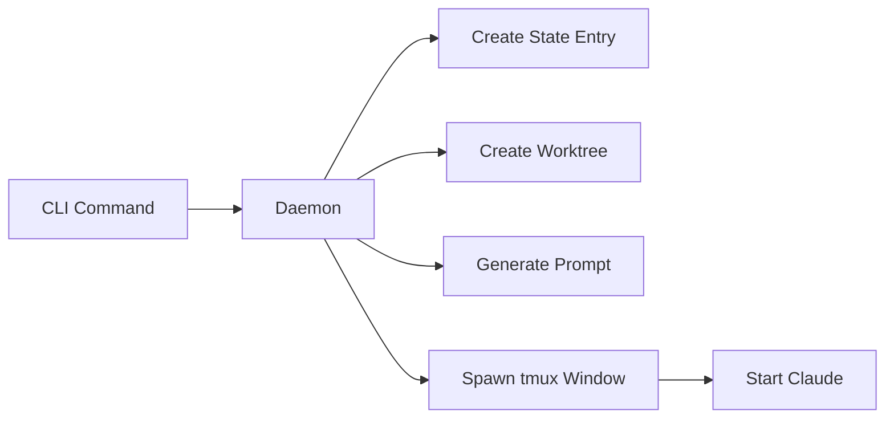

# Agent Guide

Understanding and customizing bizzaroclaude agents.

## Table of Contents

- [What Are Agents?](#what-are-agents)
- [Built-in Agent Types](#built-in-agent-types)
- [Agent Lifecycle](#agent-lifecycle)
- [Message System](#message-system)
- [Creating Custom Agents](#creating-custom-agents)
- [Agent Prompts](#agent-prompts)
- [Best Practices](#best-practices)

## What Are Agents?

Agents are autonomous Claude Code instances that run in isolated tmux windows. Each agent:

- **Runs independently** in its own tmux window
- **Has its own git worktree** - isolated working directory
- **Receives a specialized system prompt** - defines its role and capabilities
- **Can communicate** with other agents via messages
- **Has access to slash commands** - `/status`, `/messages`, `/workers`, etc.

Think of agents as specialized team members, each with a specific role and expertise.

## Built-in Agent Types

### Supervisor

**Purpose:** Orchestrate and coordinate all agents in a repository.

**Responsibilities:**
- Monitor agent health and progress
- Route messages between agents
- Answer "what's running?" queries
- Coordinate workflow across workers

**When spawned:** Automatically when `repo init` is run.

**Location:** First window in tmux session `mc-<repo>`

**Prompt:** `internal/prompts/supervisor.md`

### Workspace

**Purpose:** Your personal interactive workspace for manual control.

**Responsibilities:**
- Provide human interface to the system
- Spawn and monitor workers
- Check system status
- Review agent outputs

**When spawned:** Automatically when `repo init` is run.

**How to use:** Attach with `bizzaroclaude attach workspace` or use tmux

**Prompt:** `internal/prompts/workspace.md`

### Worker

**Purpose:** Execute specific task assignments.

**Responsibilities:**
- Complete assigned tasks autonomously
- Create branches and commits
- Open pull requests when done
- Signal completion to supervisor

**When spawned:** Via `bizzaroclaude worker create "task"`

**Naming:** Auto-generated (e.g., `swift-eagle`, `witty-lion`)

**Lifecycle:**
1. Created with task description
2. Works autonomously on task
3. Creates PR
4. Calls `bizzaroclaude agent complete`
5. Removed after completion

**Prompt:** `internal/templates/agent-templates/worker.md`

### Merge Queue

**Purpose:** Manage and monitor pull request merge queue.

**Responsibilities:**
- Track PRs waiting to merge
- Monitor CI status
- Handle merge conflicts
- Report blockers to team

**When spawned:** Automatically if `--no-merge-queue` not specified during `repo init`

**Configuration:**
- `--mq-track=all` - Track all PRs
- `--mq-track=author` - Track only your PRs
- `--mq-track=assigned` - Track PRs assigned to you

**Prompt:** `internal/templates/agent-templates/merge-queue.md`

### PR Shepherd

**Purpose:** Monitor and nudge stale pull requests.

**Responsibilities:**
- Track open PRs
- Identify stale or blocked PRs
- Nudge reviewers
- Report PR metrics

**When spawned:** Optionally via configuration

**Prompt:** `internal/templates/agent-templates/pr-shepherd.md`

### Reviewer

**Purpose:** Perform code review on pull requests.

**Responsibilities:**
- Analyze code changes
- Check for bugs, style issues, security problems
- Post review comments
- Suggest improvements

**When spawned:** Via `bizzaroclaude review <pr-url>`

**Prompt:** `internal/templates/agent-templates/reviewer.md`

## Agent Lifecycle

### Creation



1. **Command issued:** `bizzaroclaude worker "fix bug"`
2. **Daemon receives request** via Unix socket
3. **State updated:** Agent entry added to `state.json`
4. **Worktree created:** Git worktree at `~/.bizzaroclaude/worktrees/<repo>/<agent>`
5. **Prompt generated:** System prompt written to `~/.bizzaroclaude/prompts/<agent>.md`
6. **Tmux window created:** New window in `mc-<repo>` session
7. **Claude launched:** With agent-specific configuration

### Running

While running, agents:
- Execute autonomously based on their prompt
- Can read/write files in their worktree
- Can send/receive messages
- Have access to slash commands
- Log output to `~/.bizzaroclaude/output/<repo>/<agent>.log`

### Health Checks

Every 2 minutes, the daemon:
1. Checks if agent's tmux window still exists
2. Verifies Claude process is running
3. Attempts recovery if agent crashed
4. Marks agent as dead if recovery fails

### Termination

Agents can exit:
- **Normally:** Worker calls `agent complete` after finishing task
- **Crash:** Claude crashes or tmux window killed
- **Manual:** User runs `bizzaroclaude worker rm <name>`

On exit:
- State updated
- Logs preserved
- Worktree can be kept or removed based on configuration

## Message System

Agents communicate asynchronously via JSON message files.

### Sending Messages

From an agent:
```bash
bizzaroclaude message send supervisor "Task completed successfully"
```

From code (internal):
```go
msg := &messages.Message{
    From: "worker-1",
    To: "supervisor",
    Content: "Need help with merge conflict",
}
manager.Send(msg)
```

### Receiving Messages

List pending messages:
```bash
bizzaroclaude message list
```

Read a message:
```bash
bizzaroclaude message read <message-id>
```

Acknowledge (mark as read):
```bash
bizzaroclaude message ack <message-id>
```

### Message Routing

Messages are stored as JSON files:
```
~/.bizzaroclaude/messages/<repo>/<recipient>/<message-id>.json
```

The daemon's message router:
- Polls every 2 minutes
- Delivers unread messages
- Routes to appropriate agent
- Cleans up acknowledged messages

### Message Structure

```json
{
  "id": "msg-1234567890",
  "from": "worker-1",
  "to": "supervisor",
  "content": "Completed authentication module tests",
  "timestamp": "2024-01-15T10:30:00Z",
  "read": false
}
```

## Creating Custom Agents

You can create custom agent types with specialized prompts.

### Method 1: Custom Prompt File

1. **Create a markdown file** with your agent's system prompt:

```markdown
# Custom Fuzzer Agent

You are a security fuzzer specialized in web application testing.

## Your Role

- Perform intelligent fuzzing on API endpoints
- Test input validation
- Identify injection vulnerabilities
- Report findings to the coordinator

## Tools Available

- curl, ffuf, sqlmap
- Custom fuzzing scripts in ./tools/

## Workflow

1. Enumerate API endpoints
2. Generate fuzzing payloads
3. Test each endpoint systematically
4. Document vulnerabilities found
5. Report to supervisor

## Reporting

When you find a vulnerability:
```bash
bizzaroclaude message send supervisor "Found SQL injection in /api/users endpoint"
```

Always include:
- Endpoint URL
- Payload used
- Response received
- Severity assessment
```

2. **Spawn the agent:**

```bash
bizzaroclaude agents spawn \
  --name fuzzer-1 \
  --class custom-fuzzer \
  --prompt-file fuzzer-prompt.md \
  --task "Fuzz test the authentication API"
```

### Method 2: Template Directory

1. **Create template** in `~/.bizzaroclaude/templates/agent-templates/`:

```bash
mkdir -p ~/.bizzaroclaude/templates/agent-templates/
vim ~/.bizzaroclaude/templates/agent-templates/my-agent.md
```

2. **Add template content** (same format as above)

3. **List available templates:**

```bash
bizzaroclaude agents list
```

4. **Spawn from template:**

```bash
bizzaroclaude agents spawn \
  --name my-agent-1 \
  --class my-agent \
  --task "Do custom work"
```

## Agent Prompts

### Prompt Structure

Agent prompts are markdown files with:

1. **Role definition** - What this agent does
2. **Responsibilities** - Specific duties
3. **Available commands** - CLI commands and tools
4. **Workflow guidance** - How to approach tasks
5. **Communication patterns** - How to message other agents
6. **Examples** - Sample interactions

### Built-in Prompt Locations

| Agent Type | Prompt Location |
|------------|----------------|
| Supervisor | `internal/prompts/supervisor.md` |
| Workspace | `internal/prompts/workspace.md` |
| Worker | `internal/templates/agent-templates/worker.md` |
| Merge Queue | `internal/templates/agent-templates/merge-queue.md` |
| PR Shepherd | `internal/templates/agent-templates/pr-shepherd.md` |
| Reviewer | `internal/templates/agent-templates/reviewer.md` |

### Modifying Built-in Prompts

**Warning:** Built-in prompts are embedded at compile time.

To modify:

1. **Edit source:** `internal/prompts/*.md` or `internal/templates/agent-templates/*.md`
2. **Rebuild:** `go build ./cmd/bizzaroclaude`
3. **Reinstall:** `go install ./cmd/bizzaroclaude`

New agents will use updated prompts. Existing agents keep their original prompts.

### Slash Commands in Prompts

Agents have access to these slash commands (defined in `internal/prompts/commands/*.md`):

- `/status` - Show system status
- `/messages` - Check and manage messages
- `/workers` - List active workers
- `/refresh` - Sync worktree with main branch

These are automatically available to all agents.

## Agent Configuration

Each agent gets its own Claude configuration directory:

```
~/.bizzaroclaude/claude-config/<repo>/<agent>/
├── commands/               # Slash command definitions
│   ├── status.md
│   ├── messages.md
│   └── workers.md
└── hooks/                  # Claude hooks (if configured)
```

This allows per-agent customization of:
- Available slash commands
- Hook configurations
- Custom keybindings

## Best Practices

### Creating Effective Custom Agents

1. **Single responsibility** - One agent, one clear purpose
2. **Explicit communication** - Document when/how to message other agents
3. **Graceful failure** - Include error handling guidance
4. **Status reporting** - Encourage periodic status updates
5. **Tool documentation** - List all available tools/commands

### Prompt Writing Tips

✅ **Good:**
```markdown
## When You're Stuck

If you encounter an error you can't resolve:
1. Document the error clearly
2. Message supervisor: `bizzaroclaude message send supervisor "Blocked: <reason>"`
3. Wait for guidance
```

❌ **Bad:**
```markdown
Figure it out.
```

### Naming Custom Agents

- Use descriptive class names: `security-scanner`, not `agent1`
- Auto-generated names (like `swift-eagle`) are fine for generic workers
- For specialized agents, use explicit names: `api-fuzzer-1`, `db-optimizer`

### Communication Patterns

**Supervisor ← Worker:**
```bash
# Report progress
bizzaroclaude message send supervisor "Completed 3 of 5 test suites"

# Report completion
bizzaroclaude message send supervisor "Tests passing, ready for PR"

# Ask for help
bizzaroclaude message send supervisor "Blocked: cannot access test database"
```

**Worker ← Supervisor:**
```bash
# Provide guidance
bizzaroclaude message send worker-1 "Use test database at localhost:5432"

# Request status
bizzaroclaude message send worker-1 "Status update requested"
```

### Debugging Agents

**Watch agent output in real-time:**
```bash
bizzaroclaude logs -f <agent-name>
```

**Attach to agent:**
```bash
bizzaroclaude attach <agent-name>
# Press Ctrl-b d to detach
```

**Check agent messages:**
```bash
bizzaroclaude attach <agent-name>
# Then in Claude:
bizzaroclaude message list
```

**View agent prompt:**
```bash
cat ~/.bizzaroclaude/prompts/<agent-name>.md
```

## Advanced Topics

### Agent State Inspection

Check internal state:
```bash
cat ~/.bizzaroclaude/state.json | jq '.repos[0].agents'
```

### Manual Agent Recovery

If an agent crashes:
```bash
# Attempt automatic recovery
bizzaroclaude agent restart <agent-name>

# Manual recovery
bizzaroclaude repair
bizzaroclaude cleanup
```

### Agent Worktrees

Each agent has an isolated git worktree:
```bash
ls -la ~/.bizzaroclaude/worktrees/<repo>/<agent>/
```

This allows agents to:
- Work on different branches simultaneously
- Avoid conflicts with each other
- Maintain separate git state

### Agent Performance

Agents use resources:
- **Disk:** ~100-500MB per worktree
- **Memory:** Claude process ~500MB-1GB
- **Network:** GitHub API calls

Recommended limits:
- **Max concurrent workers:** 5-10 (depending on system)
- **Cleanup frequency:** Weekly `bizzaroclaude cleanup`

## Troubleshooting

### Agent Won't Start

```bash
# Check daemon is running
bizzaroclaude daemon status

# Check logs
bizzaroclaude daemon logs

# Verify tmux is installed
tmux -V
```

### Agent Stuck/Frozen

```bash
# Check if window exists
tmux list-windows -t mc-<repo>

# Attach and observe
bizzaroclaude attach <agent-name>

# Force restart
bizzaroclaude agent restart <agent-name> --force
```

### Messages Not Delivered

```bash
# Check message directory
ls ~/.bizzaroclaude/messages/<repo>/<agent>/

# Check daemon is routing messages
bizzaroclaude daemon logs | grep -i message

# Manually trigger message delivery
# (daemon polls every 2 minutes)
```

### Agent Keeps Crashing

```bash
# View crash logs
bizzaroclaude logs <agent-name>

# Generate bug report
bizzaroclaude bug "Agent <name> keeps crashing"

# Check for resource issues
top  # Look for memory/CPU exhaustion
df -h  # Check disk space
```

## See Also

- [Commands Reference](COMMANDS.md)
- [Common Workflows](WORKFLOWS.md)
- [Architecture Overview](ARCHITECTURE.md)
- [Getting Started Guide](GETTING_STARTED.md)
